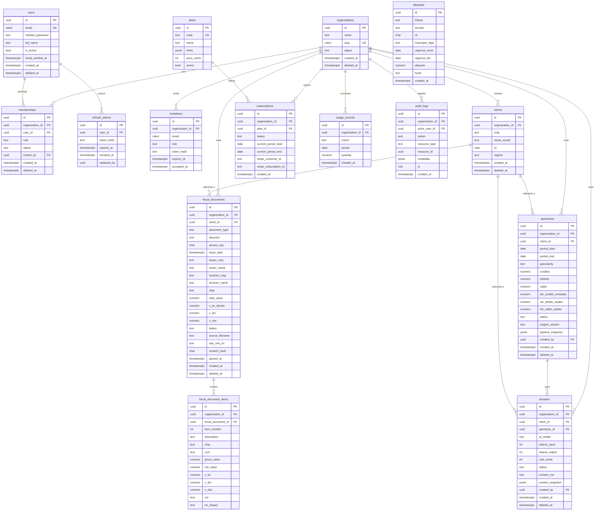

# Modelo de Dados Núcleo — Simples Apuração RTC

> Valida e detalha o "Modelo de dados (núcleo)" do diagnóstico técnico (§4.4).
> Convenções: PostgreSQL 16; PK **UUID v7** (ADR 0007); multitenancy por
> `organization_id` + **RLS** (ADR 0001); timestamps `timestamptz` UTC; dinheiro como
> `numeric`/inteiro de centavos (nunca float); `snake_case`.
> Status: **design** (não há migrations reais nesta fatia).

## 1. Classificação das tabelas quanto a tenant/RLS

| Categoria | Tabelas | `organization_id`? | RLS por org? |
|---|---|---|---|
| **Global — identidade** | `users`, `refresh_tokens` | Não | Não (autorização na aplicação) |
| **Global — referência/catálogo** | `aliquotas`, `plans` | Não | Não (leitura para todos; escrita admin) |
| **De negócio (tenant)** | `organizations`*, `memberships`, `invitations`, `clients`, `fiscal_documents`, `fiscal_document_items`, `apuracoes`, `dossiers`, `subscriptions`, `usage_records`, `audit_logs` | Sim | **Sim** (`FORCE RLS`) |

\* `organizations` é o próprio tenant: a linha tem `id` = `organization_id`; a política
RLS usa `id = current_setting('app.current_org')::uuid`.

**Postura de RLS (ADR 0001):** todas as tabelas de negócio recebem `ENABLE` + `FORCE
ROW LEVEL SECURITY` e a política
`USING (organization_id = current_setting('app.current_org')::uuid)` (mesmo predicado em
`WITH CHECK`). O role de aplicação não tem `BYPASSRLS` e não é owner. Sem a GUC
`app.current_org` definida na transação, nada é visível (**fail-closed**).

## 2. Diagrama ER (mermaid)

## 3. Entidades — papel, chaves e notas

| Entidade | Papel (diagnóstico §4.4) | PK | FKs principais | Notas de modelagem |
|---|---|---|---|---|
| `organizations` | Tenant (escritório/empresa cliente); plano e status | `id` | — | `slug` único (`citext`); `status` (active/suspended); soft-delete. |
| `users` | Pessoa física com login | `id` | — | **Global**, e-mail único (`citext`); `hashed_password` argon2 (ADR 0002); `email_verified_at`. |
| `memberships` | Liga user ↔ org com papel (RBAC) | `id` | `organization_id`, `user_id`, `invited_by` | `role ∈ {owner, admin, membro}`; único `(organization_id, user_id)`; `status` (active/invited/revoked). |
| `refresh_tokens` | Sessões de refresh rotativas | `id` | `user_id`, `replaced_by` | Guarda **hash** do token; `revoked_at`; detecção de reuso (ADR 0002). Global por user. |
| `invitations` | Convite de membro pendente | `id` | `organization_id`, `invited_by` | `email`, `role`, `token_hash`, `expires_at`, `accepted_at`. RLS por org. |
| `clients` | Empresas analisadas (CNPJs) na carteira | `id` | `organization_id` | `cnpj` (com máscara/validação); único `(organization_id, cnpj)`; `regime` (RPA/SN/MEI/UNKNOWN). |
| `fiscal_documents` | Documento fiscal (cabeçalho) | `id` | `organization_id`, `client_id` | `document_type ∈ {NFE,NFCE,CTE,NFSE,UNKNOWN}`; `direction ∈ {INBOUND,OUTBOUND,UNKNOWN}`; `access_key` 44 díg; `raw_xml_uri` aponta p/ object storage (não guarda o XML); `content_hash` p/ dedupe; único `(organization_id, client_id, access_key)`. |
| `fiscal_document_items` | Itens do documento | `id` | `organization_id`, `fiscal_document_id` | `rtc_impact ∈ {CREDIT,DEBIT,NEUTRAL}` (saída do motor fiscal); `cst`, `cfop` (metadado); valores `v_ibs/v_cbs/v_bc`. `organization_id` denormalizado p/ RLS direto. |
| `apuracoes` | Apuração por período (créditos/débitos/saldo/índices) | `id` | `organization_id`, `client_id`, `created_by` | `granularity ∈ {MONTHLY,QUARTERLY}`; `params_snapshot` (versão do motor, ref. de alíquotas) p/ reprodutibilidade; `status ∈ {DRAFT,CLOSED}`. |
| `dossiers` | Relatórios de IA gerados (modelo/tokens/custo) | `id` | `organization_id`, `client_id`, `apuracao_id`, `created_by` | `content_md` (Markdown); `context_snapshot` = agregados **anonimizados** enviados ao Gemini (LGPD); `cost_cents`, `tokens_*`. |
| `aliquotas` | Tabela versionada por vigência (2026–2033) | `id` | — | **Global/referência**; `(tributo, escopo, uf?, municipio_ibge?, vigencia_inicio, vigencia_fim, aliquota, fonte)`. Sem RLS; escrita admin. |
| `plans` | Catálogo de planos | `id` | — | **Global**; `code` único (free/pro/enterprise); `limits` (jsonb: nº docs, dossiês, tokens). |
| `subscriptions` | Assinatura da organização | `id` | `organization_id`, `plan_id` | refs Stripe; `status`; período atual. RLS por org. |
| `usage_records` | Medição de uso p/ cobrança | `id` | `organization_id` | append-only; `(metric, period, quantity)`; agrega consumo (docs, dossiês, tokens). |
| `audit_logs` | Trilha de auditoria (LGPD) | `id` | `organization_id`, `actor_user_id` | **append-only/imutável**; `action`, `resource_type`, `resource_id`, `metadata`, `ip`. RLS por org; admin pode ler tudo via role próprio. |

## 4. Índices principais (acessos reais)

| Tabela | Índices |
|---|---|
| `memberships` | UNIQUE `(organization_id, user_id)`; `(user_id)` p/ "minhas orgs". |
| `users` | UNIQUE `(email)`. |
| `clients` | UNIQUE `(organization_id, cnpj)`; `(organization_id)`. |
| `fiscal_documents` | UNIQUE `(organization_id, client_id, access_key)`; `(organization_id, client_id, issue_date DESC, id)` p/ keyset/período; `(organization_id, cfop)`; `(organization_id, content_hash)` dedupe. |
| `fiscal_document_items` | `(organization_id, fiscal_document_id)`; `(organization_id, rtc_impact)`. |
| `apuracoes` | UNIQUE `(organization_id, client_id, period_start, period_end, granularity)`; `(organization_id, client_id, period_start DESC)`. |
| `dossiers` | `(organization_id, client_id, created_at DESC, id)`; `(organization_id, apuracao_id)`. |
| `aliquotas` | `(tributo, escopo, uf, municipio_ibge, vigencia_inicio)`; busca por vigência (range). |
| `subscriptions` | UNIQUE `(organization_id)` (assinatura ativa única); `(stripe_subscription_id)`. |
| `usage_records` | `(organization_id, metric, period)`. |
| `audit_logs` | `(organization_id, created_at DESC, id)`; `(actor_user_id, created_at DESC)`. |

> Os índices compostos começam por `organization_id` para casar com o filtro do RLS e
> com a paginação keyset definida no ADR 0003.

## 5. Decisões e premissas (apontadas para validação)

1. **PK UUID v7** (ADR 0007): gerada na aplicação (PG 16 sem `uuidv7()` nativo).
2. **`users` global, não tenant-scoped:** um usuário participa de várias organizações
   via `memberships`. Decisão alinhada ao padrão B2B SaaS e ao §4.4 (users + memberships
   separados). Implica autorização cuidadosa na aplicação para `users`/`refresh_tokens`.
3. **`aliquotas` como referência global versionada por vigência:** o motor de cálculo
   usa, por padrão, os **valores destacados no XML** (SPEC_BUSINESS_RULES, premissa 7); a
   tabela serve para **projeção, validação e simulação** da transição 2026–2033. Não tem
   `organization_id`. *Questão aberta:* haverá necessidade de **overrides por
   organização**? Se sim, criar `organization_aliquota_overrides` (tenant-scoped) depois.
4. **Soft-delete (`deleted_at`)** em `organizations`, `memberships`, `clients`,
   `fiscal_documents`, `apuracoes`, `dossiers`. **`audit_logs` e `usage_records` são
   append-only/imutáveis** (não têm soft-delete). *Tensão LGPD:* soft-delete conflita com
   o direito de eliminação — é preciso um caminho de **hard-delete/anonimização** para
   atender o titular (item do oficial-lgpd, Fase 3). Documentar política de retenção.
5. **PII / dados sensíveis em `fiscal_documents`:** `issuer_name`, `receiver_name`,
   `issuer_cnpj`, `receiver_cnpj` são dados pessoais/comerciais; `receiver_cnpj` pode ser
   **CPF de consumidor** (NFC-e). Minimização: gravar `CONSUMIDOR_FINAL` quando anônimo;
   avaliar **criptografia em coluna** para CPF. *Questão aberta para o oficial-lgpd:*
   quais colunas cifrar em repouso e qual a retenção do `raw_xml_uri`.
6. **`organization_id` denormalizado em tabelas-filhas** (`fiscal_document_items`) para
   que a política RLS seja direta (sem JOIN) e os índices comecem por ele.
7. **Reprodutibilidade fiscal:** `apuracoes.params_snapshot` e `engine_version` guardam o
   contexto de cálculo (versão do motor, referência de alíquotas) para auditar/reproduzir
   uma apuração mesmo após mudanças de regra — exigência de precisão fiscal.
8. **Valores monetários** em `numeric` (precisão fiscal), nunca float; percentuais de
   índice também `numeric`. Custos de IA em `cost_cents` (inteiro).

## 6. Mapeamento com o domínio do motor fiscal

O `fiscal_engine` (ADR 0004) define os **tipos puros** (`FiscalDocument`, `FiscalItem`,
`RtcImpact`, resultado de `Apuracao`) independentes do banco. As tabelas
`fiscal_documents`/`fiscal_document_items`/`apuracoes` são a **persistência** desses
tipos; a conversão (domínio ↔ ORM) fica na camada de repositório do `backend/app`, nunca
no engine. A regra de impacto (INBOUND→CREDIT / OUTBOUND→DEBIT / CFOP excluído→NEUTRAL —
SPEC_XML_MAPPING_v2) e o cálculo de apuração (SPEC_BUSINESS_RULES §6) são do engine; o
banco apenas guarda o resultado e o snapshot de parâmetros.

## 7. Pendências de data-model (F0.7b resultado, migrations futuras)

A implementação de F0.7b entrega tipos puros no `fiscal_engine` (apuração, conformidade,
índices); as tabelas de persistência estão **planejadas mas não migradas** nesta fatia.
O engenheiro-dados criará as migrations em fatia futura. Abaixo, os **GAPs conhecidos**
para implementação:

### 7.1 Tabela `apuracoes` — novos campos para F0.7b

Colunas a adicionar (migration futura) — campos FLAT (sem classe separada de índices):

| Coluna | Tipo | Descrição |
|---|---|---|
| `creditos_ibs` | `numeric` | Σ v_ibs onde `rtc_impact == CREDIT` |
| `creditos_cbs` | `numeric` | Σ v_cbs onde `rtc_impact == CREDIT` |
| `debitos_ibs` | `numeric` | Σ v_ibs onde `rtc_impact == DEBIT` |
| `debitos_cbs` | `numeric` | Σ v_cbs onde `rtc_impact == DEBIT` |
| `saldo_ibs` | `numeric` | creditos_ibs - debitos_ibs |
| `saldo_cbs` | `numeric` | creditos_cbs - debitos_cbs |
| `creditos` | `numeric` | creditos_ibs + creditos_cbs (agregado, só para exibição) |
| `debitos` | `numeric` | debitos_ibs + debitos_cbs (agregado, só para exibição) |
| `saldo` | `numeric` | saldo_ibs + saldo_cbs (agregado, só para exibição) |
| `base_entradas` | `numeric` | Σ v_bc para INBOUND (universo de crédito) |
| `base_saidas` | `numeric` | Σ v_bc para OUTBOUND (universo de débito) |
| `idx_credito_entradas` | `numeric` | Índice de crédito de entradas (agregado) — None → NULL |
| `idx_debito_saidas` | `numeric` | Índice de débito de saídas (agregado) — None → NULL |
| `idx_saldo_saidas` | `numeric` | Índice de saldo (agregado) — com sinal — None → NULL |
| `idx_saldo_saidas_ibs` | `numeric` | Índice de saldo IBS (por tributo) — com sinal — None → NULL |
| `idx_saldo_saidas_cbs` | `numeric` | Índice de saldo CBS (por tributo) — com sinal — None → NULL |
| `conforme_count` | `integer` | Contagem de unidades CONFORME (por item/doc-level) |
| `inconformidade_count` | `integer` | Contagem de unidades INCONFORMIDADE |
| `nao_avaliado_count` | `integer` | Contagem de unidades NAO_AVALIADO |
| `documentos_count` | `integer` | Total de documentos apurados |
| `itens_count` | `integer` | Total de unidades aferíveis (itens ou doc-level) |

**Nota — Agregados (NUNCA liquidação):**
- `creditos`, `debitos`, `saldo` = soma IBS+CBS; existem apenas para **exibição e insumo de índice**.
- `idx_credito_entradas`, `idx_debito_saidas`, `idx_saldo_saidas` = índices agregados (exibição).
- **Liquidação fiscal exige usar saldo_ibs + saldo_cbs separados**, nunca agregado.
- **Apenas `idx_saldo_saidas` tem variante por tributo** (`idx_saldo_saidas_ibs`, `idx_saldo_saidas_cbs`); crédito/débito não têm.

**Recomendação:** Engenheiro-dados deve derivar enums PG (CHECK) do StrEnum do fiscal_engine
para evitar drift (fonte única).

### 7.2 Tabela `fiscal_document_items` — novos campos para F0.7b

Colunas a adicionar (migration futura):

| Coluna | Tipo | Descrição |
|---|---|---|
| `conformity` | `text enum` | CONFORME / INCONFORMIDADE / NAO_AVALIADO (corresponde ao enum `Conformity`) |
| `conformity_reason` | `text enum` | Razão de conformidade (11 valores, enum `ConformityReason`): DATA_AUSENTE, PRE_2026, DIRECAO_DESCONHECIDA, NAO_COMERCIAL, EXPORTACAO_IMUNE, DESTAQUE_PRESENTE, REGIME_SIMPLES, REGIME_MEI, REGIME_DESCONHECIDO, RPA_SEM_DESTAQUE, SIMPLES_EXCESSO_SEM_DESTAQUE |

**Nota:** Coluna `rtc_impact` (saída de F0.7a: CREDIT/DEBIT/NEUTRAL) já existe.

**Recomendação:** Engenheiro-dados deve DERIVAR os enums PG (CHECK ou tipo ENUM) do StrEnum
do fiscal_engine (`enums.py`) — fonte única, zero drift.

### 7.3 Estrutura de lista de inconformidades

Não há tabela específica nesta versão. Opções para F1.0/F1.x:

- **Opção A (tabela-filha):** `inconformidades` (PK uuid, FK apuracao_id, item_number ou item_id, reason, ...) — append-only para auditoria.
- **Opção B (JSONB):** `apuracoes.inconformidades_snapshot` → array de { item_number, reason, description, detected_at, ... }.
- **Opção C (derivado):** Query `fiscal_document_items` com `WHERE apuracao_id IN (...) AND conformity = 'INCONFORMIDADE'`.

Decidir em fatia de repositório (F1.0+).

### 7.4 Política de agregados (IMPORTANTE — LGPD e precisão fiscal)

- Agregados (`creditos`, `debitos`, `saldo` — nomes reais do engine) existem **apenas como derivado de exibição** e insumo de cálculo de índice.
- **Nunca aparecem em liquidação fiscal:** o fisco exige desagregação IBS/CBS.
- **Auditoria/rastreabilidade:** campos booleanos (ex., `aggregates_computed`) podem marcar quando agregado foi recalculado (pós-SME ou pós-update de regra).

### 7.5 Validação adicional antes de migration

Antes de implementar as colunas acima, engenheiro-dados deve:

1. **Confirmar com SME fiscal:**
   - Base de cálculo: v_bc ou gross_value? (Adotado v_bc §2.3; ajuste em F3.6 se SME pedir.)
   - Sinal do idx_saldo_saidas*: positivo = crédito, negativo = déficit? (Adotado sinal; validar.)
   - MEI: regime distinto de SN? (Hoje NAO_AVALIADO/REGIME_MEI conservador.)
   - CRT=2 → SIMPLES_EXCESSO? Outro mapeamento?
   - UNKNOWN regime: há inferência ou fica NAO_AVALIADO?
   - Exportação 7.1xx–7.8xx (EXPORTACAO_IMUNE) vs. 7.9xx (NAO_COMERCIAL): conformidade esperada?

2. **Confirmar com arquiteto:**
   - Agregados compatíveis com soft-delete (se apuração_id referenciada for deletada)?
   - RLS: fiscal_document_items já tem organization_id denormalizado. apuracoes também. indices?
   - Índices: aceitar NULL em div-zero, ou usar -999 / sentinel?

3. **Testes de migration:** criar fixture de dados antigos, validar upcast sem perda.

---

## Convenção de nomenclatura para tipos puros (fiscal_engine)

Os tipos puros do motor (`Apuracao`, `Conformity`, `ConformityReason`, etc.) vivem em
`/backend/fiscal_engine/` (ADR 0004). Campos são `snake_case`. Enums são **StrEnum**
(valores textuais = nomes, em MAIUSCULAS — ex.: `Conformity.CONFORME`, `ConformityReason.DATA_AUSENTE`).

Conversão PEP 586 (dataclass → ORM) fica na camada de repositório, nunca no engine.

**Importante (LGPD/precisão fiscal):**
- Engenheiro-dados deve derivar enums PG (tipo ENUM ou CHECK) do StrEnum do fiscal_engine
  (`/workspace/backend/fiscal_engine/enums.py`) — fonte única de verdade.
- Evita drift entre código e banco: quando um novo valor entra no enum Python, o engenheiro
  atualiza a migration PG refletindo exatamente os mesmos valores.
